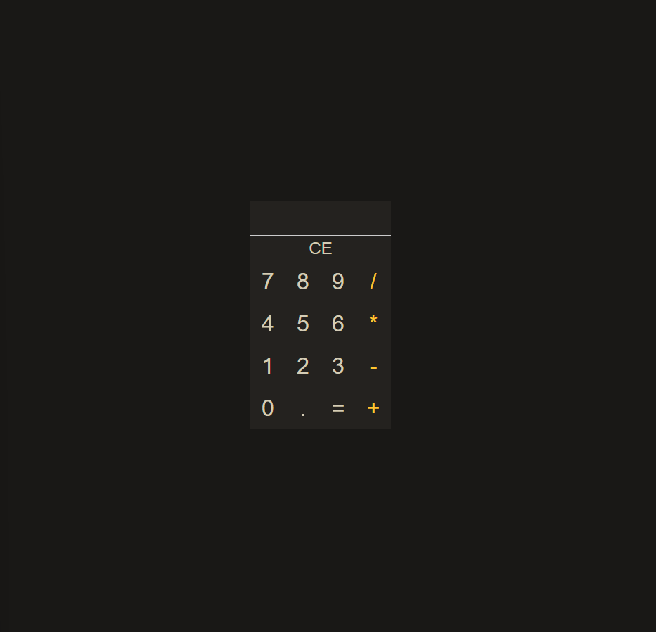

# Calculadora simples / Simple calculator

# Sobre o projeto / About the project

Neste projeto foi criado uma calculadora simples, e foi feito no curso de JavaScript do canal do YouTube da Hora de Codar, com teoria, exercícios e projetos.

This project was created a simple calculator, and it was developed in the JavaScript course on the Hora de Codar YouTube channel, with theory, exercises and projects.

## Layout
##### Desktop

# Tecnologias utilizadas / Tech stack
- HTML
- CSS
- JavaScript

## Autor

